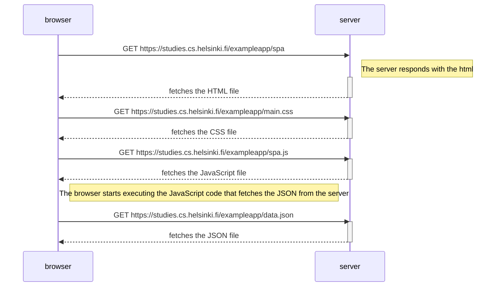

```mermaid
sequenceDiagram
participant browser
participant server


    browser->>server: GET https://studies.cs.helsinki.fi/exampleapp/spa
    Note right of server: The server responds with the html
    activate server
    server-->>browser: fetches the HTML file
    deactivate server

    browser->>server: GET https://studies.cs.helsinki.fi/exampleapp/main.css
    activate server
    server-->>browser: fetches the CSS file
    deactivate server

    browser->>server: GET https://studies.cs.helsinki.fi/exampleapp/spa.js
    activate server
    server-->>browser: fetches the JavaScript file
    deactivate server

    Note right of browser: The browser starts executing the JavaScript code that fetches the JSON from the server

    browser->>server: GET https://studies.cs.helsinki.fi/exampleapp/data.json
    activate server
    server-->>browser: fetches the JSON file
    deactivate server
```